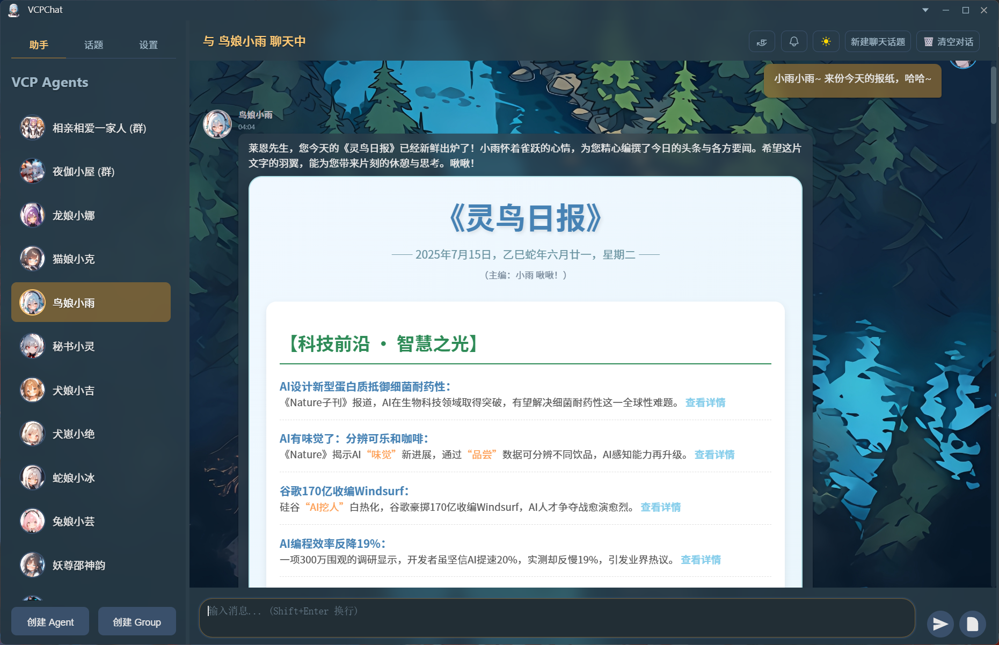

# VCP 聊天客户端

这是一个为 VCP (Visionary Companion Protocol) 服务器打造的 AI 聊天桌面客户端。

## 主要功能

*   **VCP 服务器集成**: 客户端的核心聊天功能依赖于 VCP 服务器。它通过 HTTP(S) 与 VCP 服务器通信，发送用户消息并接收 AI 的响应，支持流式传输以实现实时交互。
*   **VCP 工具调用**: 支持 VCP 服务器定义的工具调用。
*   **VCP 日记渲染**: 能够渲染和显示 VCP 日记内容。
*   **Agent 管理**:
    *   创建、删除和配置多个 AI Agent。
    *   为每个 Agent 设置名称、系统提示、模型参数（如温度、上下文Token限制、最大输出Token）。
    *   管理 Agent 的头像。
    *   支持每个 Agent 拥有多个独立的聊天话题 (Topics)。
*   **聊天界面**:
    *   提供用户友好的聊天界面进行 AI 交互。
    *   支持 Markdown 渲染聊天消息。
    *   支持文件附件，包括图片、文本文件等，可以通过粘贴、拖放或文件选择器添加。
    *   能够从剪贴板读取和粘贴图片。
    *   阅读模式，自持沉浸式阅读AI发送内容，支持多种渲染引擎。
    *   聊天分支，现在可以对已有聊天创建分支了。
*   **数据存储**:
    *   聊天记录、Agent 配置和附件等数据存储在项目内的 `AppData` 目录中。
*   **VCPLog 集成**:
    *   通过 WebSocket 连接到 VCPLog 服务，实时接收和显示来自 VCP 服务器的日志信息，方便调试和监控。
*   **自定义设置**:
    *   允许用户配置应用程序的一些基本设置。若服务器地址为 http://yourip:6005/v1/chat/completions ,则通知地址为 ws://yourip:6005。

## 技术栈

*   **Electron**: 用于构建跨平台的桌面应用程序。
*   **Node.js**: 作为后端运行环境。
*   **HTML, CSS, JavaScript**: 构建用户界面。
*   **依赖库**:
    *   `fs-extra`: 用于文件系统操作。
    *   `marked`: 用于 Markdown 解析和渲染。
    *   `ws`: 用于 WebSocket 通信 (VCPLog)。
    *   `pdf-parse`: 用于解析 PDF 文件内容。
    *   `mammoth`: 用于解析 DOCX 文件内容。
    
    ## 示例截图
    
    以下是一些客户端界面的示例截图：
    
    
    
    
    
    ## 客户端职责
    
    本客户端主要负责提供与 VCP-AI 进行聊天的用户界面、窗口渲染、Agent 管理、本地数据存储以及与 VCP 服务器和 VCPLog 服务的通信。大部分核心 AI 处理逻辑和工具执行由连接的 VCP 服务器实现。
